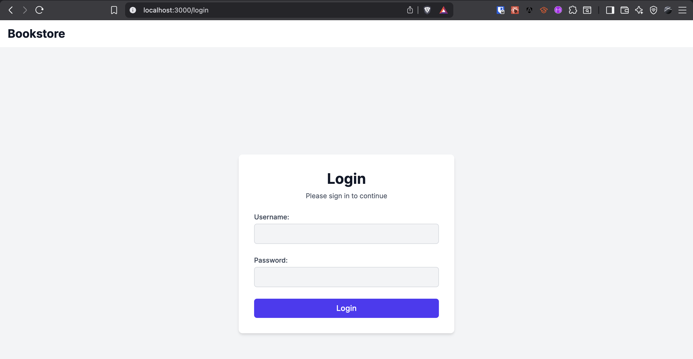
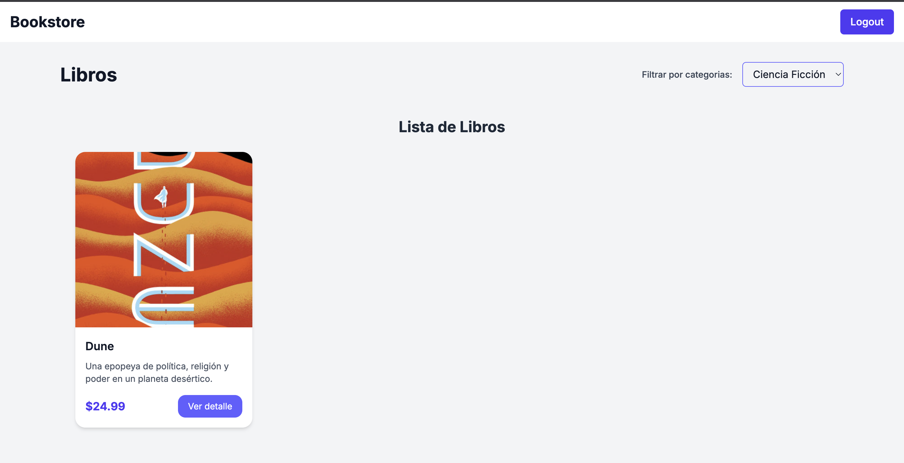
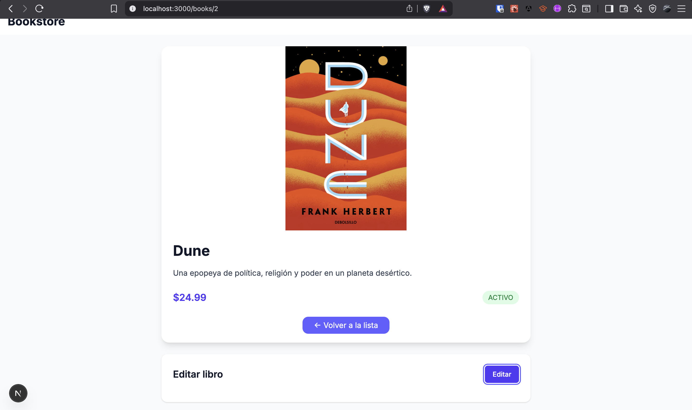

## Bookstore - Frontend (Next.js)

Breve frontend para administrar libros, autenticado contra una API en Spring Boot.

### Cómo ejecutar el frontend

Requisitos: Node 18+ y el backend corriendo en `http://localhost:8080`.

1. Instalar dependencias:
   ```bash
   npm install
   ```
2. Ejecutar en desarrollo:
   ```bash
   npm run dev
   ```
3. Abrir `http://localhost:3000` en el navegador.

El proyecto usa un rewrite en `next.config.mjs` para proxyear todas las llamadas `/api/*` hacia `http://localhost:8080/api/*`, evitando CORS.

### Funcionalidades destacadas

- Login con JWT y manejo de errores de forma amigable.
- Listado y filtrado de libros por categoría.
- Detalle de libro.
- Edición de libro (PUT `/api/books/{id}`) con formulario validado.

Login:



Listado de libros:


Filtrado por categoría:



Edición de libro:

